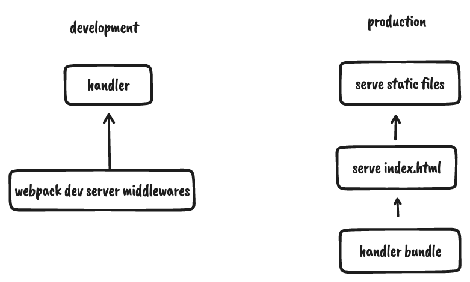

# mix-webpack-plugin

[](https://npm.im/mix-webpack-plugin)

## Motivation

This plugin is inspired by [vite-plugin-mix](https://github.com/egoist/vite-plugin-mix), which help you to write the front-end and back-end API in the single project, this plugin brings you Nextjs DX to your webpack app.



## Install

```bash
npm i mix-webpack-plugin -D

npm i webpack webpack-cli webpack-dev-server -D
```

## Usage

```javascript
// webpack.config.js

{
  plugins: [
    // ...
    new MixWebpackPlugin({
      handler: './server/handler.js'
    })
 ],
}
```

``` javascript
// handler.js
const handler = async (req, res, next) => {
  if (req.path === '/id') {
    res.end('hello world')
    return
  }
  next()
}

module.exports = {handler}
```

## License

MIT @ [brandonxiang](./LICENSE)